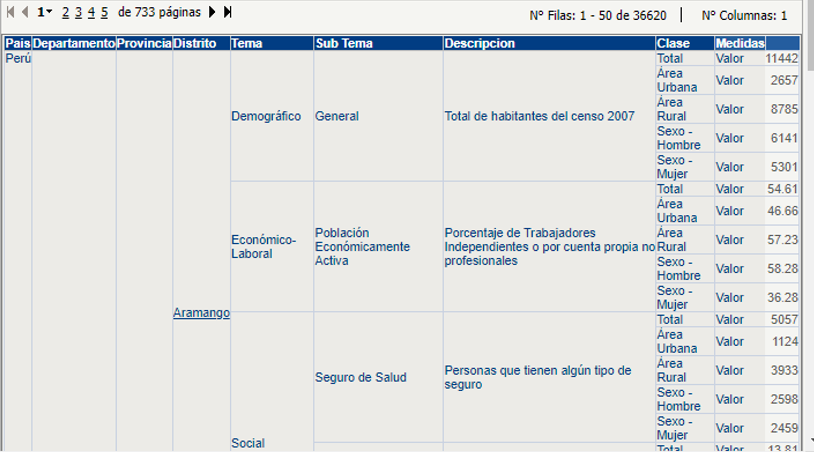
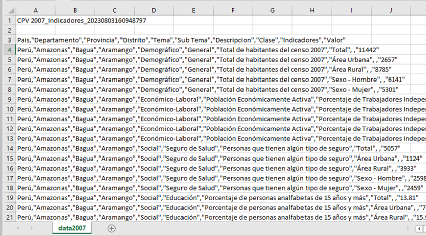
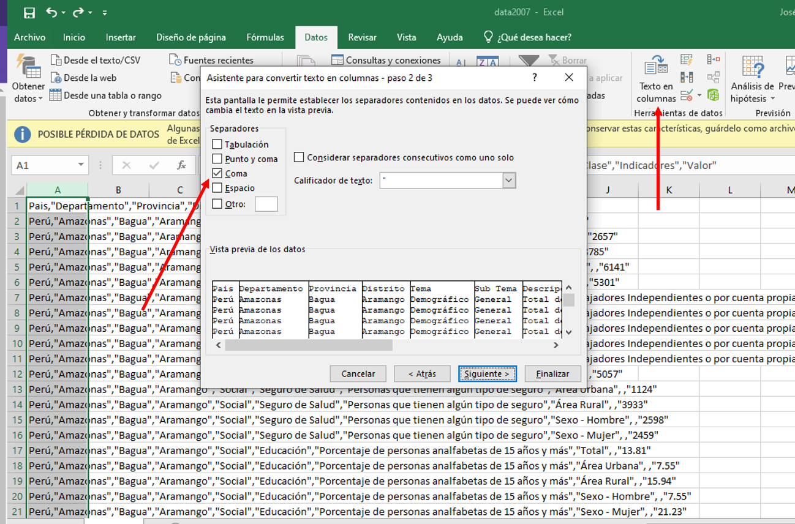

<center>

<h1>Estadística para el Análisis Político 2</h1>

</center>

<br>

Profesor:[Dr. José Manuel MAGALLANES REYES, Ph.D](http://www.pucp.edu.pe/profesor/jose-manuel-magallanes/%22%20target=%22_blank) <br>

-   Profesor Principal del Departamento de Ciencias Sociales, Sección de Ciencia Política y Gobierno.

-   [Oficina 223](https://goo.gl/maps/xuGeG6o9di1i1y5m6) - Edificio CISEPA / ECONOMIA / CCSS

-   Telefono: (51) 1 - 6262000 anexo 4302

-   Correo Electrónico: [jmagallanes\@pucp.edu.pe](mailto:jmagallanes@pucp.edu.pe)

<a id='beginning'></a>

------------------------------------------------------------------------

<center>

<header>

<h2>Regresionando conteos</h2>

</header>

</center>

<center><a href="https://doi.org/10.5281/zenodo.7059207"></a></center>

------------------------------------------------------------------------

```{r klippy, echo=FALSE, include=TRUE}
klippy::klippy(position = c('top', 'right'))
```

# Data como conteos

Las variables que representan conteos son prominentes en las ciencias sociales. Podemos encontrar muchas en los indicadores que se crean en los censos. Por ejemplo, el Instituto Nacional de Estadística del Perú (INEI), organizó muy bien diversos indicadores para su XI Censo de Población y VI Censo de Vivienda [@inei2007] en su portal para el 2007. Si queriamos descargar los indicadores disponibles para ese censo a nivel distrital, simplemente se accede a su [página](http://ineidw.inei.gob.pe/ineidw/) y se selecciona todos los distritos (es lo que queremos en este momento):


Descarguemos los siguientes indicadores a nivel de distrito:

-   Conteos:
    -   Número de personas que tienen algún tipo de seguro.
    -   Total de habitantes (2007).
-   Procentajes:
    -   Porcentaje de Trabajadores Independientes o por cuenta propia no profesionales.
    -   Porcentaje de personas analfabetas de 15 años y más.

Para ello, en el portal debes seleccionar esos indicadores de esta manera:


Al pedir "procesar" aparece este resultado en otra página:


Esa página permite que reorganices los datos. Entonces, busca darle este formato:



Luego, descargalo con CSV (añade **.csv** al nombre de archivo), ábrelo en **Excel** y verás algo así:



Nota que todo ha aperecido en una sola columna. Como se ve, cada columna tiene una coma que la separa de otra; sepáralas de manera adecuaday guardalo como **.xlsx** (aprovecha de eliminar las primeras dos columnas) .



El archivo guardado lo podemos guardar en un repositorio de GitHub, y abrirlo desde ahí.

```{r}
rm(list = ls())

library(rio)

censo2007=import("https://github.com/Estadistica-AnalisisPolitico/Sesion3/raw/main/data2007peru.xlsx")
head(censo2007)
```

Veamos qué tipos de datos tenemos, y los nombres de columnas:

```{r}
str(censo2007)
```

Lo más notorio es que la columna **Valor** ha sido interpretada como texto y no cómo tipo numérico. R hará eso si es que alguna celda tiene un carácter que no sea número o punto. Veamos:

```{r}
# qué celda tiene algo que no sea número
censo2007$Valor[!grepl("[0-9]", censo2007$Valor)]
```

Sabiendo ello, podemos convertir la columna a numérico sin temor a perder valores:

```{r, message=FALSE}
censo2007$Valor=as.numeric(censo2007$Valor)
```

Ahora, podemos quedarnos las columnas que utilizaremos en el ejemplo :

```{r}
censo2007_sub=censo2007[,-c(1,5,6,9)] # -c() elimina esas columnas
# queda
str(censo2007_sub)
```

Este último data frame está en formato **long**:

```{r}
library(magrittr)
head(censo2007_sub,20)%>%
    rmarkdown::paged_table(options = )
```

Reconocemos el formato **long** cuando, sabiendo que la unidad de análisis es el distrito, vemos que el distrito se repite en muchas filas. Arriba vemos que todas las variables de Aramango aparecen al lado de este distrito. Nota además que los *nombres de las variables* están en las filas (no como titulos de las columnas) y que los *valores de la variable* aparecen en la última fila.

Pasémoslo a formato **wide**:

```{r}

library(reshape2)
censo2007_wide=dcast(data=censo2007_sub,
                     formula=Departamento+Provincia+Distrito ~ Descripcion+Clase,
                     value.var="Valor")
```

Los nombres de columnas son muy largos luego de esta conversión serán muy largos:

```{r}
# columnas del formato wide
names(censo2007_wide)
```

Pero podemos cambiarlos por nombres más cortos así:

```{r}
# uso de gsub()
# donde diga "Area Rural" cambiar a "rural":
names(censo2007_wide)=gsub(pattern = "Área Rural",
                           replacement = "rural",
                           x = names(censo2007_wide))

names(censo2007_wide)=gsub(pattern = "Área Urbana",
                           replacement = "urban",
                           x = names(censo2007_wide))

names(censo2007_wide)=gsub(pattern = "Sexo - Hombre",
                           replacement = "Hombre",
                           x = names(censo2007_wide))

names(censo2007_wide)=gsub(pattern = "Sexo - Mujer",
                           replacement = "Mujer",
                           x = names(censo2007_wide))

names(censo2007_wide)=gsub(pattern = "Sexo - Mujer",
                           replacement = "Mujer",
                           x = names(censo2007_wide))

names(censo2007_wide)=gsub(pattern = "Personas que tienen algún tipo de seguro",
                           replacement = "conSeguro",
                           x = names(censo2007_wide))

names(censo2007_wide)=gsub(pattern = "Porcentaje de personas analfabetas de 15 años y más",
                           replacement = "analfa",
                           x = names(censo2007_wide))

names(censo2007_wide)=gsub(pattern = "Porcentaje de Trabajadores Independientes o por cuenta propia no profesionales",
                           replacement = "indep",
                           x = names(censo2007_wide))

names(censo2007_wide)=gsub(pattern = "Total de habitantes del censo 2007",
                           replacement = "poblacion",
                           x = names(censo2007_wide))

# nuevos nombres
names(censo2007_wide)
```

¿Cómo nos quedaríamos por ahora con las columnas de "Totales"?

```{r}
# grep() devuelve las posiciones
grep(pattern = "Total",names(censo2007_wide))
```

Procedamos:

```{r}
colsTotal=grep(pattern = "Total",names(censo2007_wide))
censo2007_wide_Totales=censo2007_wide[,c(1,2,3,colsTotal)]

# ahora:
head(censo2007_wide_Totales)

```

Planteemos la primera hipótesis:

> A nivel distrital, la cantidad de personas con algún seguro de salud está afectada por el nivel analfabetismo.

De lo visto en las sesiones anteriores [@magallanes_estadistica-analisispoliticosesion1_2022-1; @magallanes_estadistica-analisispoliticosesion2_2022-1], podríamos intentar una regresión lineal, que nos daría estos resultados:

```{r rl1,warning=FALSE, message=FALSE, results='asis'}
library(knitr)
library(modelsummary)

h1=formula(conSeguro_Total~analfa_Total)

rl1=lm(h1, data = censo2007_wide_Totales)

model1=list('OLS asegurados (I)'=rl1)
modelsummary(model1, title = "Resumen de Regresion Lineal",
             stars = TRUE,
             output = "kableExtra")
```

Como vemos en la Tabla \@ref(tab:rl1), el covariado (conocido como predictor o variable independiente) salió con un valor absoluto alto, negativo, y significativo (es muy poco probable - menos de 0.1% - que no tenga efecto), pero con un R-2 ajustado muy bajo. Como el modelo no nos da buen *ajuste*, es muy probable que la evaluación del modelo no sea satisfactoria. Así, vemos en la Figura \@ref(fig:evaluacionrl1) que difícilmente este modelo puede ser útil.

```{r evaluacionrl1,fig.cap="Diagnósticos para el modelo OLS asegurados (I) "}
par(mfrow = c(2, 2))  
plot(rl1, 1,caption = '');title(main="Linealidad")
plot(rl1, 2, caption = '');title(main="Normalidad")
plot(rl1, 3, caption = '');title(main="Homocedasticidad")
plot(rl1, 5, caption = '');title(main="Influyentes")
```

Podríamos mejorar este modelo si controlásemos el tamaño de la población en el modelo. Veamos la Tabla \@ref(tab:rl12).

```{r rl12,warning=FALSE, message=FALSE, results='asis'}
library(knitr)
library(modelsummary)

h1control=formula(conSeguro_Total~analfa_Total + poblacion_Total )

rl2=lm(h1control, data = censo2007_wide_Totales)

modelslm=list('OLS asegurados (I)'=rl1,'OLS asegurados (II)'=rl2)
modelsummary(modelslm, title = "Regresiones Lineales",
             stars = TRUE,
             output = "kableExtra")
```

Se ve una gran mejora en el R2 ajustado con el modelo II de la Tabla \@ref(tab:rl12). Veamos sus gráficas de diagnóstico en la Figura \@ref(fig:evaluacionrl2).

```{r evaluacionrl2,fig.cap="Diagnósticos para el modelo OLS asegurados (II) "}
par(mfrow = c(2, 2))  
plot(rl2, 1,caption = '');title(main="Linealidad")
plot(rl2, 2, caption = '');title(main="Normalidad")
plot(rl2, 3, caption = '');title(main="Homocedasticidad")
plot(rl2, 5, caption = '');title(main="Influyentes")
```

Las gráficas de la Figura \@ref(fig:evaluacionrl2) nos muestran un mejor escenario, pero nota que nuestro predictor dejó de ser significativo ante la presencia de la variable de control. Quizá debimos dar un paso más sencillo: analizar la naturaleza de la variable dependiente. Veamos la Figura \@ref(fig:hisVD) para entenderla mejor.

```{r hisVD,message=FALSE,fig.cap="Descripción de la Variable Dependiente"}
library(ggplot2)
VarDep=censo2007_wide_Totales$conSeguro_Total
descris=list(min=min(VarDep),
             max=max(VarDep),
             media=round(mean(VarDep),2),
             var=round(var(VarDep),2),
             asim=round(e1071::skewness(VarDep),2),
             kurt=round(e1071::kurtosis(VarDep),2))

base=ggplot(data=censo2007_wide_Totales, aes(x=conSeguro_Total)) + theme_classic()
hist=base + geom_histogram(bins=50)
histInfo=hist + annotate("text", x = 100000, y = 1050,
                         color='grey50',
                       label = paste0("Minimo: ",descris$min))
histInfo = histInfo + annotate("text", x = 100000, y = 900,
                       color='grey50',
                       label = paste0("Máximo: ",descris$max))

histInfo = histInfo + annotate("text", x = 100000, y = 650,
                       color='grey50',
                       label = paste0("Media: ",descris$media))

histInfo = histInfo + annotate("text", x = 100000, y = 500,
                       color='grey50',
                       label = paste0("Varianza: ",descris$var))

histInfo = histInfo + annotate("text", x = 100000, y = 350,
                       color='grey50',
                       label = paste0("Asimetría: ",descris$asim))

histInfo = histInfo + annotate("text", x = 100000, y = 200,
                       color='grey50',
                       label = paste0("Curtosis: ",descris$kurt))

histInfo
    
```

El histograma de la Figura \@ref(fig:hisVD) nos muestra una distribución con asimetría positiva (cola a la derecha) y super leptocurtica. Ello nos hace reflexionar que nuestra variable dependiente representa conteos, valores enteros positivos. La regresión lineal tendrá problemas pues asume que la variable dependiente tiene valores reales y no acotados. Así mismo, el sesgo presente lo aleja de una 'campana' de Gauss, por lo que debilitaría los cálculos de significancia si los datos no siguen una tendencia lineal; claro está que uno puede transformar la variable dependiente, pero ello a la vez complicará la interpretación.

# Regresión Poisson

La regresión Poisson tiene sus supuestos [@glen_poisson_2016]:

1.  **Variable Respuesta** Es un conteo (Y) por unidad de tiempo o espacio, que puede ser descrita por la distribución Poisson (por ejemplo *asaltos* por dia). Puede además ser un ratio ($\lambda$) cuando la unidad de tiempo o espacio varía para cada conteo (por ejemplo *votos a favor* del *total de votos*) .
2.  **Independencia** Las observaciones (filas) no deben tener relación entre sí.
3.  **Media=Varianza** Por definición, la media de una variable que se distribuye como Poisson debe ser igual a su varianza (equidispersión). Si la varianza supera significativamente a la media hablamos de sobredispersión; pero si la media fuera mucho mayor que la varianza tendríamos subdispersión.
4.  **Linealidad** El logaritmo de la variable dependiente (los conteos) debe ser una función lineal de los covariados.

Reimplementemos nuestra hipótesis original usando la regresión Poisson. Los resultados los vemos en la Tabla \@ref(tab:rp1rl2), comparándolos con el resultado de la regresión lineal controlada por la población.

```{r rp1rl2,warning=FALSE, message=FALSE, results='asis'}

rp1=glm(h1, data = censo2007_wide_Totales, 
        offset=log(poblacion_Total), #exposure 
        family = poisson(link = "log"))

# displaying results
modelslmpoi=list('OLS asegurados (II)'=rl2,
                 'POISSON asegurados'=rp1)

modelsummary(modelslmpoi, title = "Regresiones OLS y Poisson",
             stars = TRUE,
             output = "kableExtra")
```

Ahora que tenemos ambas regresiones en la Tabla \@ref(tab:rp1rl2), vemos que el modelo Poisson le devuelve efecto a la independiente. Nótese que la Poisson está modelando los conteos, teniendo en cuenta la exposición (*exposure*), añadida usando *offset*. Esto no siempre es necesario, pero en este caso sí lo era, pues necesitamos controlar la *exposure* de manera explícita (la población) [^1]. Sin embargo, el AIC de la Poisson es aun mayor que el de la Gaussiana [^2] (veremos luego cómo ello mejora en la Tabla \@ref(tab:exp-rbn)).

[^1]: No sería diferente si tuvieramos *hijos por hogar*, *postulaciones por político*.

[^2]: AIC nos permite comparar entre modelos. Un menor AIC es preferido. Los mismo se puede decir del BIC.

## Interpretación

Ya que sabemos cuándo usar una regresión Poisson, alteremos la hipótesis anterior:

> A nivel distrital, la cantidad de personas con algun seguro de salud está afectada por el nivel analfabetismo y por la presencia de trabajadores independientes.

```{r rp1rp2,warning=FALSE, message=FALSE, results='asis'}

h2=formula(conSeguro_Total~analfa_Total + indep_Total)
    
rp2=glm(h2, data = censo2007_wide_Totales, 
        offset=log(poblacion_Total),
        family = poisson(link = "log"))


modelsPois=list('POISSON asegurados (I)'=rp1,
                'POISSON asegurados (II)'=rp2)
modelsummary(modelsPois, 
             title = "Regresiones Poisson anidadas",
             stars = TRUE,
             output = "kableExtra")
```

La interpretación de la Tabla \@ref(tab:rp1rp2) NO es tan directa como lo era en la regresión lineal. Demos una interpretación simple, sin hacer ningún cálculo, de los resultados del modelo II de la Tabla \@ref(tab:rp1rp2):

-   En el modelo II ambos predictores son significativos;
-   En el modelo II, a mayor analfabetismo, mayor cantidad de asegurados;
-   En el modelo II, a mayor cantidad de trabajadores independientes, menor cantidad de asegurados.

Sin embargo, la interpretación precisa de los coeficientes de la Tabla \@ref(tab:rp1rp2) requiere más cálculos; tengamos primero en cuenta lo que la regresión Poisson ha calculado usando la Ecuación \@ref(eq:poi):

```{=tex}
\begin{equation}
\log(Y) = \log(\lambda) =\alpha + \beta \cdot X + \epsilon (\#eq:poi)
\end{equation}
```
Cuando el *exposure* es constante modelamos conteos (Y); cuando no lo es modelamos ratios ($\lambda$)[^3]. Pero, como vemos en la Ecuación \@ref(eq:poi), los coeficiente necesitan ser exponenciados para saber el efecto sobre Y. Veamos la Tabla \@ref(tab:exp-rp2).

[^3]: Los conteos con *offset*.

```{r exp-rp2,warning=FALSE, message=FALSE, results='asis'}

# formula para limitar a 4 digitos decimales, 
# sin que se muestre notación científica:
formatoNum <- function(x) format(x, digits = 4, scientific = FALSE)

modelsummary(modelsPois,
             fmt=formatoNum, # uso mi formula
             exponentiate = T, # exponenciar!!!!!
             statistic = 'conf.int',
             title = "Regresión Poisson - coeficientes exponenciados",
             stars = TRUE,
             output = "kableExtra")
# mas simple:
#cbind(exp(coef(rp2)),exp(confint(rp2)))
```

La Tabla \@ref(tab:exp-rp2) tiene los coeficientes exponenciados, así mismo, muestra los intervalos de confianza (exponenciados) en vez de los errores típicos. Nota que mientras en la regresión lineal no deseábamos que nuestro coeficiente esté cerca al cero, es decir, que su intervalo de confianza no incluya al *cero*, aquí no deseamos que el intervalo de confianza incluya al *uno*.

Una vez exponenciado, podemos interpretar los coeficientes de manera más sencilla. Así, para el modelo II se ve que:

-   por cada unidad que aumente el analfabetismo la cantidad esperada de asegurados se multiplica por 1.016, es decir, aumentaría en un 1.6% (100 x \|1-1.016\|) en promedio.

-   por cada unidad que aumente los trabajadores independientes, la cantidad esperada de asegurados se multiplica por 0.99, es decir, disminuiría en 1% (100 x \|1-0.99\|) [@choueiry_interpret_2022] en promedio.

Nótese que la regresión propone un efecto multiplicativo sobre el promedio de la respuesta (la regresión OLS o Gaussiana propone un efecto aditivo).

# Equidispersión

Uno de los supuestos en la Regresión Poisson es que la **media** y la **varianza** sean iguales. De los estadigrafos de la Figura \@ref(fig:hisVD) se mostró que estos valores no están cercanos, de hecho la razón varianza - media es:

```{r}
round(descris$var/descris$media,2)
```

Aquí es clara la sobredispersión, pero en caso haya dudas podemos poner a prueba la *hipótesis de equidispersion* [@hilbe_statistical_2017]. Veamos la Tabla \@ref(tab:tabla-disper).

```{r tabla-disper, message=FALSE}
library(magrittr)
overdispersion=AER::dispersiontest(rp2,alternative='greater')$ p.value<0.05
underdispersion=AER::dispersiontest(rp2,alternative='less')$ p.value<0.05
# tabla
testResult=as.data.frame(rbind(overdispersion,underdispersion))
names(testResult)='Es probable?'
testResult%>%kable(caption = "Test de Equidispersión")%>%kableExtra::kable_styling()
```

La Tabla \@ref(tab:tabla-disper) muestra que es altamente improbable que la varianza sea igual a la media, por lo que se opta por aceptar que lo más probable es que tengamos sobredispersión.

## La Quasi Poisson

La presencia de sobredispersión puede tratarse con la *quasipoisson*; veamos la Tabla \@ref(tab:rqp).

```{r rqp, warning=FALSE, message=FALSE, echo=TRUE,results='asis'}
rqp = glm(h2, data = censo2007_wide_Totales,
          offset=log(poblacion_Total),
          family = quasipoisson(link = "log"))

modelsPQP=list('POISSON asegurados (II)'=rp2,'QUASIPOISSON asegurados (II)'=rqp)

modelsummary(modelsPQP, 
             title = "Regresiones Poisson y QuasiPoisson",
             stars = TRUE,
             output = "kableExtra")
```

La Tabla \@ref(tab:rqp) nos muestra cosas interesantes:

-   Los coeficientes son los mismos para ambos modelos:

```{r, message=FALSE}

cbind(coef_Poi=coef(rp2),coef_QuasiPoi=coef(rqp))

```

-   Pero no los errores típicos:

```{r,  message=FALSE}
library(arm)
cbind(se_Poi=se.coef(rp2),se_QuasiPoi=se.coef(rqp))
```

La regresión quasipoisson lidia con la sobredispersión al recalcular los errores típicos, lo que afectaría la significancia de los predictores; de ahí que calcula nuevos intervalos de confianza:

```{r exp-rqp,warning=FALSE, message=FALSE, results='asis'}
modelsQPexp=list('QuasiPoisson asegurados (II) exponenciado'=rqp)


modelsummary(modelsQPexp,fmt=formatoNum,
             exponentiate = T, 
             statistic = 'conf.int',
             title = "EXP() de la Regresión Quasi Poisson (II) para Interpretación",
             stars = TRUE,
             output = "kableExtra")
```

## La Binomial Negativa

Una buena alternativa ante la sobredispersión es usar la *regresión binomial negativa*. Comparemos todas la regresiones exponenciadas, como se ve en la Tabla \@ref(tab:exp-rbn).

```{r exp-rbn,warning=FALSE, message=FALSE, results='asis'}
h2off=formula(conSeguro_Total ~ analfa_Total + indep_Total + offset(log(poblacion_Total)))

rbn=glm.nb(h2off,data=censo2007_wide_Totales)

modelsQP_BN=list('Poisson asegurados (II)'=rp2,
                 'QuasiPoisson asegurados (II)'=rqp,
                 'Binomial Negativa asegurados (II)'=rbn)


modelsummary(modelsQP_BN,fmt=formatoNum,
             exponentiate = T, 
             statistic = 'conf.int',
             title = "EXP() de la Regresiones Poisson, Quasi Poisson  y Binomial Negativa",
             stars = TRUE,
             output = "kableExtra")
```

Nótese en la Tabla \@ref(tab:exp-rbn) que los coeficientes obtenidos en la regresión binomial negativa son diferentes a los demas. Además, los AIC son mucho mejores para caso de la Binomial Negativa (recuerda los AIC de la Tabla \@ref(tab:rp1rl2)); los AIC/BIC podemos verlos así de manera alternativa:

```{r aicbic}
data.frame(Model = c("poisson", "quasipoisson", "negative-binomial"),
           AIC = c(AIC(rp2), AIC(rqp), AIC(rbn)),
           BIC = c(BIC(rp2), BIC(rqp), BIC(rbn)),stringsAsFactors = FALSE
)%>%
kable(caption = "AIC / BIC para los modelos de conteos")%>%kableExtra::kable_styling(full_width = FALSE)
```

# Comparación de modelos

La Tabla \@ref(tab:aicbic) es la mejor alternativa antes modelos no anidados. Una alternativa adicional sería verificar la sobredispersión producida en los modelos:

```{r}
# poisson case
performance::check_overdispersion(rp2)
```

```{r}
# quasipoisson case
performance::check_overdispersion(rqp)
```

```{r}
# negative binomial case
performance::check_overdispersion(rbn)
```

Como estos modelos NO son anidados, usaremos con cuidado la tabla anova, esta vez pidiendo un test chi-cuadrado; veamos el resultado en la Tabla \@ref(tab:anovarall).

```{r anovarall}
anova(rp2,rqp,rbn,test = "Chisq") %>%
kable(caption = "Tabla ANOVA para comparar modelos")%>%kableExtra::kable_styling(full_width = FALSE)
```

La caída del *Deviance* es tanta para el último caso (de 754119 a 1868) que la mejor opción es la binomial negativa. Sin embargo, la quasipoisson, como se vió en la Tabla \@ref(tab:exp-rbn) no tiene ni AIC/BIC ni enlace Log, por lo que se produce p-valores como perdidos. Veamos la alternativa del *loglikelihood ratio test* como se recomienda en @bobbitt_negative_2021 para casos no anidados, pero sin usar la quasipoisson:

```{r poibineg}
lmtest::lrtest(rp2,rbn)%>%
kable(caption = "loglikelihood ratio test")%>%kableExtra::kable_styling(full_width = FALSE)
```
La Tabla \@ref(tab:poibineg) sugiere la binomial negativa. Por lo general, la binomial negativa es más utilizada que la quasipoisson, pero la binomial negativa no es apropiada para la subdispersión, mientras que la quasipoisson sí se usa para ese caso. Una manera adicional de comparar es la gráfica. Así, la Tabla \@ref(tab:exp-rbn) se puede ver de manera gráfica en la Figura \@ref(fig:finplots).

```{r finplots, fig.cap="Comparación visual de modelos", message=FALSE, warning=FALSE}
library(ggplot2)
dotwhisker::dwplot(list(Poisson=rqp,CuasiPoisso=rqp,BinomialNegativa=rbn),exp=T) + scale_y_discrete(labels=c("trabajo\nindependiente","analfabetismo")) + scale_color_discrete(name="Modelos para:\nCantidad de Asegurados") + geom_vline(
           xintercept = 1,
           colour = "grey60",
           linetype = 2
       )
```

Finalmente, podemos calcular los coeficientes estandarizados [@ibm_spss_computing_2020] para saber cuál de los predictores tiene mayor efecto (ver Tabla \@ref(tab:stdCoefs)).

```{r stdCoefs}
sdVD=sd(censo2007_wide_Totales$conSeguro_Total)
sdVIs=apply(censo2007_wide_Totales[,c("analfa_Total","indep_Total")],2,sd)
DF=list(Poisson=sdVIs*coef(rp2)[c(2,3)]/sdVD,
     CuasiPoisson=sdVIs*coef(rqp)[c(2,3)]/sdVD,
     BinomNegativa=sdVIs*coef(rbn)[c(2,3)]/sdVD)%>%
       data.frame()

DF%>% kable(caption = "Coeficientes Standarizados (ordenar vía valores absolutos)")%>%
          kableExtra::kable_styling(full_width = F)

```

------------------------------------------------------------------------

# Bibliografía {.unnumbered}

::: {#refs}
:::

<br></br> <br></br> [al INICIO](#beginning) <br></br> <br></br>
